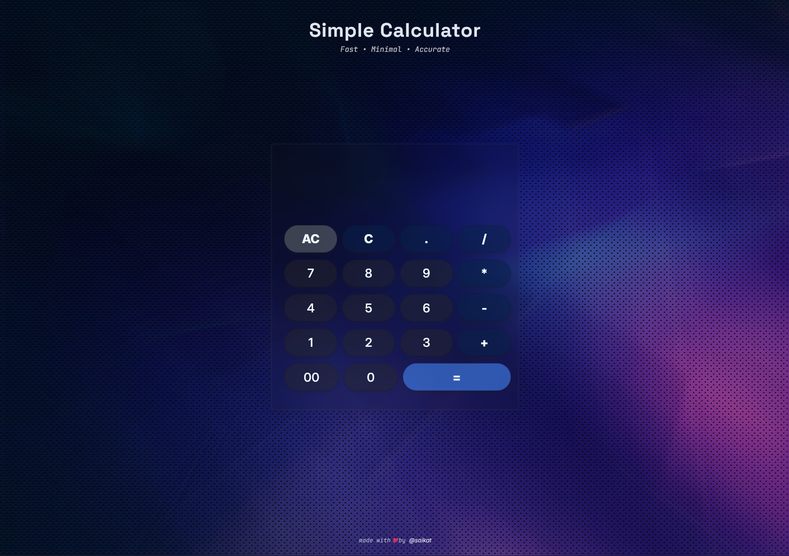

# Basic JS Calculator

A responsive, minimal, fast, and simple JavaScript calculator.

## Features

- **Responsive Design:** Works seamlessly on desktop and mobile devices.
- **Minimal UI:** Clean and distraction-free interface.
- **Fast Performance:** Instant calculations with no lag.
- **Basic Operations:** Supports addition, subtraction, multiplication, and division.

## Getting Started

1. **Clone the repository:**
    ```bash
    git clone https://github.com/saikat-codes/js-calculator.git
    ```
2. **Open `index.html` in your browser.**

## Usage

- Enter numbers and operators using the buttons.
- View results instantly as you calculate.
- Clear or reset calculations with the "C" button.

## Technologies Used

- HTML5
- CSS3 (Flexbox for responsiveness)
- JavaScript (Vanilla)

## Folder Structure

```
js-calculator/
├── index.html
├── style.css
├── script.js
├── screenshot.png
└── README.md
```

## GitHub Pages

You can view the calculator live via [GitHub Pages](https://saikat-codes.github.io/js-calculator/).

## Screenshots


